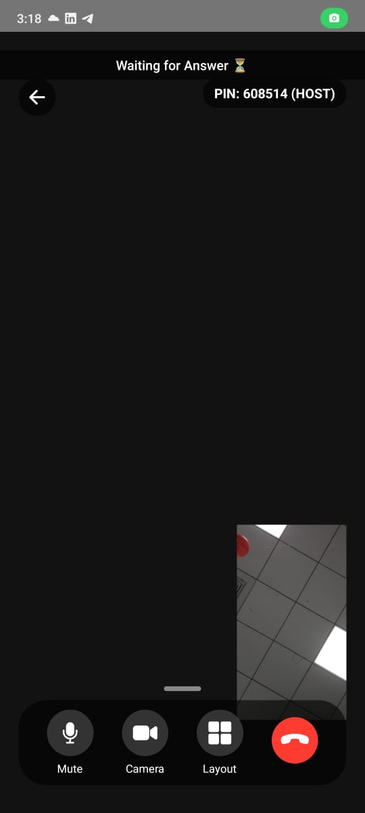

**An untraceable, high-security, low-liability video calling app** that allows users to communicate without sharing personal information like phone numbers, WhatsApp, Zoom accounts, or website logins.

---


## 🚀 Features

- **No personal data required** – No phone number, email, or sign-in needed.
- **Peer-to-peer WebRTC calls** – Direct connection without middle servers.
- **High security** – Uses Firebase for signaling without storing user data.
- **Efficient** – Built using React Native with Expo.
- **No traceability** – Calls leave no logs and are instantly removed after ending.
- **Easy to set up** – Works with a simple PIN-based connection.
- **Perfect for lovers ❤️** – Call freely without fear of chat history, call logs, or tracking.


*(Add a GIF or image here showcasing the app in action.)*

---

## 🛠️ Tech Stack

- **React Native** (Bare Workflow)
- **Firebase** (for signaling)
- **WebRTC** (for real-time peer-to-peer calls)
- **Expo Modules** (for permissions, camera, and microphone access) or React-Native (I forgot).

---

## 📥 Installation

### 🔧 Manual Setup

1. **Clone the repository**:

   ```sh
   git clone https://github.com/yourusername/kabootar.git
   cd kabootar
   ```

2. **Install dependencies**:

   ```sh
   npm install  # or yarn install
   ```

3. **Create Firebase Config**:

   - Inside `app/config/`, create a file named `firebase.jsx`.
   - Add your Firebase configuration inside this file:

   ```javascript
   import { initializeApp } from "firebase/app";

   const firebaseConfig = {
       apiKey: "YOUR_API_KEY",
       authDomain: "YOUR_AUTH_DOMAIN",
       projectId: "YOUR_PROJECT_ID",
       storageBucket: "YOUR_STORAGE_BUCKET",
       messagingSenderId: "YOUR_MESSAGING_SENDER_ID",
       appId: "YOUR_APP_ID"
   };

   export const firebaseApp = initializeApp(firebaseConfig);
   ```

4. **Run the app**:

   ```sh
   npx expo start  # For development
   npx expo prebuild && npx react-native run-android  # For Android (after ejecting Expo)
   ```

---

## 📦 Building the APK

### **Using EAS (Recommended)**

1. **Install EAS CLI** (if not installed):
   ```sh
   npm install -g eas-cli
   ```
2. **Log in to Expo**:
   ```sh
   eas login
   ```
3. **Build the APK**:
   ```sh
   eas build --profile production --platform android
   ```

### **Manual Build**

If you want to build the APK manually:

```sh
cd android && ./gradlew assembleRelease
```

---

## 🔐 Permissions Required

The app requires the following permissions:

- **Camera** 📷 (for video calls)
- **Microphone** 🎙️ (for audio communication)
- **Internet** 🌐 (for WebRTC signaling & connectivity)

---

## ❌ Known Issues

- **Call Disconnect Issue**: When a call ends, the peer-to-peer connection **does not fully close**, even after attempting to disconnect three times. The reason is unknown at the moment. To close the connection, remove the app from the recents else the other person might still be able to hear from your mic.
- **No TURN Server**: The app relies only on Google's STUN servers. If a user is behind a strict NAT or firewall, connection issues may occur.
- **No Back Camera**: Right now, there is no button to switch to back camera, there used to but the video to the remote streams stopped so I removed it. 
- **Audio from earpiece**: The audio by default is routed through the earpiece, tried using InCallManager to route the audio through the speaker, but it didnt work. I recommend using a bluetooth earphone for the best experience.


*(Feel free to submit an issue, but I may not have time to fix it.)*

---

## 🤝 Contributions & License

This project is **not** an open-source project, but it is **public for people to use as they want**.

- You are **not required** to contribute, but feel free to **star the repo** or mention me if you find it useful.
- If you want a similar app, you can **write a ChatGPT prompt** to generate the base code for yourself.

---

## 📸 Screenshots




---

## 📝 Disclaimer

This app is designed for private, secure communication. However, **I am not responsible** for how it is used or any security vulnerabilities that arise from its implementation. Use it at your own risk.

---

🎯 **If you like this project, give it a ⭐ on GitHub!**

## 🔮 Future Advancements  

Kabootar is already **secure and efficient**, but here are some **possible future upgrades**:  

- **📂 File Sharing via WebRTC DataChannel**  
  Send PDFs, images, and documents directly over the peer-to-peer connection, without third-party servers.  

- **🖥️ Screen Sharing**  
  Share your screen with the other caller using WebRTC’s built-in screen capture APIs.  

- **🎛️ Advanced Audio Routing**  
  Fixing the earpiece-only issue, allowing seamless switching between earpiece, speaker, and Bluetooth.  

- **🔄 Back Camera Support**  
  Bringing back the toggle to switch between front and back cameras without breaking remote video streams.  

- **🛑 Call Timeout & Auto Cleanup**  
  Automatically clean up inactive calls and handle unexpected disconnects more gracefully.  


## 📝 License  

This project is licensed under the MIT License – see the [LICENSE](./LICENSE) file for details.  

